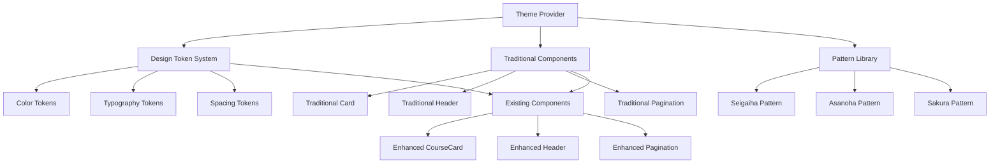

# 設計書：日本伝統デザインシステム

## 概要

この設計書は、既存のNext.js 14+コース学習サイトに日本の伝統的なデザイン要素を統合するための包括的なアプローチを定義します。設計は、現代的な技術スタック（TypeScript、Tailwind CSS、Server Components）を活用しながら、本格的な日本の美学を提供することに焦点を当てています。

システムは以下の主要コンポーネントで構成されます：
- 中央集権的なテーマシステム
- 伝統的なデザイン要素を持つUIコンポーネント
- レスポンシブで アクセシブルなレイアウトシステム
- 繊細なアニメーションとインタラクション

## アーキテクチャ

### 全体アーキテクチャ



### レイヤー構造

1. **テーマレイヤー**: デザイントークンとテーマプロバイダー
2. **コンポーネントレイヤー**: 伝統的なUIコンポーネント
3. **パターンレイヤー**: 視覚的パターンとテクスチャ
4. **統合レイヤー**: 既存コンポーネントとの統合

### 技術スタック統合

- **Next.js 14+ App Router**: Server Componentsをデフォルトで使用
- **TypeScript**: 厳密モードですべてのコンポーネントを型付け
- **Tailwind CSS**: カスタムデザイントークンで拡張
- **CSS Variables**: 動的テーマ切り替えのサポート

## コンポーネントとインターフェース

### テーマシステム

#### ThemeProvider コンポーネント
```typescript
interface ThemeProviderProps {
  theme: 'light' | 'dark' | 'seasonal';
  children: React.ReactNode;
  seasonalVariant?: 'spring' | 'summer' | 'autumn' | 'winter';
}

interface DesignTokens {
  colors: {
    sumi: string;        // 墨黒
    washi: string;       // 和紙白
    sakura: string;      // 桜ピンク
    bamboo: string;      // 竹緑
    sunset: string;      // 夕焼けオレンジ
    indigo: string;      // 藍
    gold: string;        // 金
  };
  typography: {
    japanese: {
      fontFamily: string;
      lineHeight: number;
      letterSpacing: string;
    };
    latin: {
      fontFamily: string;
      lineHeight: number;
      letterSpacing: string;
    };
  };
  spacing: {
    tatami: string;      // 畳比例ベース
    shaku: string;       // 尺単位
    sun: string;         // 寸単位
  };
}
```

#### TraditionalCard コンポーネント
```typescript
interface TraditionalCardProps {
  children: React.ReactNode;
  variant: 'washi' | 'bamboo' | 'sakura';
  pattern?: 'seigaiha' | 'asanoha' | 'sakura' | 'none';
  elevation?: 'flat' | 'raised' | 'floating';
  className?: string;
}
```

#### TraditionalHeader コンポーネント
```typescript
interface TraditionalHeaderProps {
  title: string;
  subtitle?: string;
  pattern: 'seigaiha' | 'asanoha';
  showBrushStroke?: boolean;
  navigation?: NavigationItem[];
}

interface NavigationItem {
  label: string;
  href: string;
  isActive?: boolean;
}
```

#### PatternBackground コンポーネント
```typescript
interface PatternBackgroundProps {
  pattern: 'seigaiha' | 'asanoha' | 'sakura' | 'bamboo';
  opacity?: number;
  color?: string;
  size?: 'small' | 'medium' | 'large';
  animated?: boolean;
}
```

### アニメーションシステム

#### TransitionWrapper コンポーネント
```typescript
interface TransitionWrapperProps {
  children: React.ReactNode;
  type: 'ink-spread' | 'paper-fold' | 'brush-stroke';
  duration?: number;
  delay?: number;
  respectReducedMotion?: boolean;
}
```

### タイポグラフィシステム

#### JapaneseText コンポーネント
```typescript
interface JapaneseTextProps {
  children: React.ReactNode;
  variant: 'heading' | 'body' | 'caption';
  direction?: 'horizontal' | 'vertical';
  emphasis?: 'normal' | 'brush' | 'calligraphy';
  className?: string;
}
```

## データモデル

### テーマ設定
```typescript
interface ThemeConfig {
  id: string;
  name: string;
  displayName: string;
  colors: ColorPalette;
  typography: TypographyConfig;
  spacing: SpacingConfig;
  patterns: PatternConfig;
  animations: AnimationConfig;
}

interface ColorPalette {
  primary: ColorScale;
  secondary: ColorScale;
  accent: ColorScale;
  neutral: ColorScale;
  semantic: SemanticColors;
}

interface ColorScale {
  50: string;
  100: string;
  200: string;
  300: string;
  400: string;
  500: string;
  600: string;
  700: string;
  800: string;
  900: string;
}

interface SemanticColors {
  success: string;
  warning: string;
  error: string;
  info: string;
}
```

### パターン設定
```typescript
interface PatternConfig {
  seigaiha: {
    svg: string;
    viewBox: string;
    colors: string[];
  };
  asanoha: {
    svg: string;
    viewBox: string;
    colors: string[];
  };
  sakura: {
    svg: string;
    viewBox: string;
    colors: string[];
    animated: boolean;
  };
}
```

### コンポーネント状態
```typescript
interface ComponentState {
  theme: string;
  pattern: string;
  isAnimated: boolean;
  reducedMotion: boolean;
  seasonalVariant?: string;
}
```

## エラーハンドリング

### テーマ読み込みエラー
- フォールバックテーマの提供
- エラー境界での優雅な劣化
- ユーザーへの適切なフィードバック

### パターン読み込みエラー
- デフォルトパターンへのフォールバック
- SVGパターンの検証
- 非同期読み込みエラーの処理

### アクセシビリティエラー
- コントラスト比の自動検証
- キーボードナビゲーションの確保
- スクリーンリーダー互換性の維持

## テスト戦略

### 単体テスト
- 各コンポーネントの個別テスト
- プロップスの検証
- レンダリング結果の確認
- エラー状態のテスト

### 統合テスト
- テーマプロバイダーとコンポーネントの統合
- 既存コンポーネントとの互換性
- レスポンシブ動作の検証

### アクセシビリティテスト
- WCAG 2.1 AA準拠の確認
- キーボードナビゲーションテスト
- スクリーンリーダーテスト
- カラーコントラストテスト

### 視覚回帰テスト
- コンポーネントの視覚的一貫性
- 異なるテーマでの表示確認
- レスポンシブデザインの検証

### パフォーマンステスト
- バンドルサイズの監視
- レンダリングパフォーマンス
- アニメーションの滑らかさ
- 画像とSVGの最適化

## 正確性プロパティ

*プロパティとは、システムのすべての有効な実行において真であるべき特性や動作のことです。本質的に、人間が読める仕様と機械で検証可能な正確性保証の橋渡しをする形式的な記述です。*

### プロパティ1: テーマシステム完全性
*任意の*テーマ設定に対して、すべての必要なデザイントークン（伝統色、タイポグラフィスケール、間隔トークン、テーマバリアント）が存在し、有効な値を持つこと
**検証対象: 要件 1.1, 1.2, 1.3, 1.4**

### プロパティ2: 伝統的スタイリング適用
*任意の*伝統コンポーネントに対して、指定されたパターン（青海波、麻の葉、桜）、和紙テクスチャ、墨筆ストローク効果、ぼかしグラデーション、ホバー効果が適切に適用されること
**検証対象: 要件 2.1, 2.2, 2.3, 2.4, 2.5**

### プロパティ3: 日本語タイポグラフィ対応
*任意の*日本語テキストに対して、横書き・縦書きレイアウト、適切なフォントファミリー、文字間隔、行の高さが正しく適用されること
**検証対象: 要件 3.1, 3.2, 3.3**

### プロパティ4: レスポンシブ動作保持
*任意の*ビューポートサイズに対して、伝統的な比例、パターンの歪み防止、間隔関係が維持されること
**検証対象: 要件 4.1, 4.2, 4.3**

### プロパティ5: アクセシビリティ準拠
*任意の*伝統コンポーネントに対して、WCAG 2.1 AAコントラスト要件、十分な色コントラスト、キーボードナビゲーション、適切なARIAラベル、スクリーンリーダー対応が満たされること
**検証対象: 要件 5.1, 5.2, 5.3, 5.4, 5.5**

### プロパティ6: アニメーション統合性
*任意の*アニメーション要素に対して、フェードイン効果、ホバートランジション、ページトランジション、ローディングアニメーションが適切に動作し、モーション軽減設定が尊重されること
**検証対象: 要件 6.1, 6.2, 6.3, 6.4, 6.5**

### プロパティ7: パターンライブラリ完全性
*任意の*パターン要求に対して、本格的な伝統的幾何学パターン、和紙テクスチャ、季節バリエーションが提供されること
**検証対象: 要件 7.1, 7.2, 7.3**

### プロパティ8: 既存コンポーネント統合互換性
*任意の*既存コンポーネント（CourseCard、Header、Pagination）に対して、伝統的スタイリングが適用されながら、既存の機能、TypeScriptインターフェース、レスポンシブ動作、アクセシビリティ基準が維持されること
**検証対象: 要件 8.1, 8.2, 8.3, 8.4, 8.5**